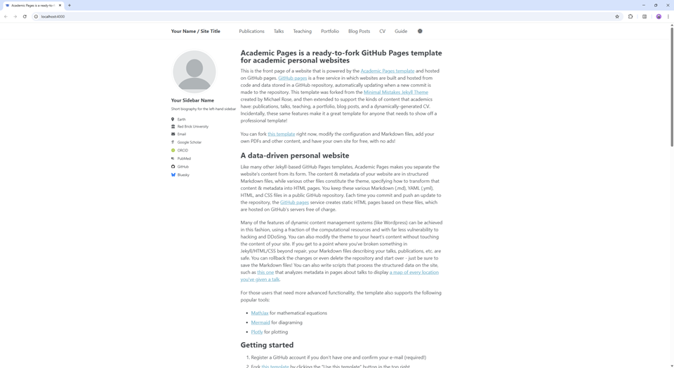

# Minimal Academic Page
This repository starts from the Academic Pages template but removes every optional feature so you can launch a simple one-page site. Only the About page remains, backed by the Minimal Mistakes theme and the standard GitHub Pages toolchain.



## Getting Started
1. Register a GitHub account if you don't have one and confirm your e-mail (required).
1. Click the **Use this template** button in the top right.
1. Name the new public repository `[your GitHub username].github.io` so it becomes your website URL.
1. Update `_config.yml` with your details (name, description, avatar, links) and edit `_pages/about.md` with your own content.
1. Upload any supporting documents (like PDFs) to the `files/` directory; they will be served from `https://[your GitHub username].github.io/files/...`.
1. Check build status under **Settings → Pages** in your repository.

## Running Locally
Preview your changes locally before pushing them to GitHub:
1. Clone the repository.
1. Ensure you have Ruby (with headers), Bundler, and Node.js installed.
   - Linux / WSL: `sudo apt install ruby-dev ruby-bundler nodejs`
   - macOS (Homebrew): `brew install ruby node` then `gem install bundler`
1. Install dependencies with `bundle install`. If you hit permissions issues, run `bundle config set --local path 'vendor/bundle'` and retry.
1. Serve the site with `jekyll serve -l -H localhost` (or `bundle exec jekyll serve ...`). Restart the server after changing `_config.yml`.

If you are on Linux you may need `sudo apt install build-essential gcc make` before building native gems.

### Docker Option
Avoid local dependencies by building the provided container:
```bash
chmod -R 777 .
docker compose up
```
Visit `http://localhost:4000` once the container reports that the site is running.

### VS Code Dev Container
Visual Studio Code users can select **F1 → DevContainer: Reopen in Container** to launch the included development container, which automatically serves the site at `http://localhost:4000` with live reload.

## Maintenance
Bug reports and feature requests for the upstream template belong on the [Academic Pages issue tracker](https://github.com/academicpages/academicpages.github.io/issues/new/choose). Questions about customization can go to the [GitHub discussions board](https://github.com/academicpages/academicpages.github.io/discussions).

This repository ultimately traces back to the [Minimal Mistakes Jekyll Theme](https://mmistakes.github.io/minimal-mistakes/), © 2016 Michael Rose and released under the MIT License. Academic Pages is maintained by [Robert Zupko](https://github.com/rjzupkoii) and collaborators.

## Contributing
If you wish to send improvements upstream, fork the original Academic Pages project instead of this stripped-down copy. Mixing template updates with personal changes can introduce merge conflicts, so keep backups of your `_config.yml` and Markdown content before upgrading.

---
<div align="center">


[](https://github.com/academicpages/academicpages.github.io/graphs/contributors)
[](https://github.com/academicpages/academicpages.github.io/releases/latest)
[](https://github.com/academicpages/academicpages.github.io/blob/master/LICENSE)

[](https://github.com/academicpages/academicpages.github.io)
[](https://github.com/academicpages/academicpages.github.io/fork)
</div>
